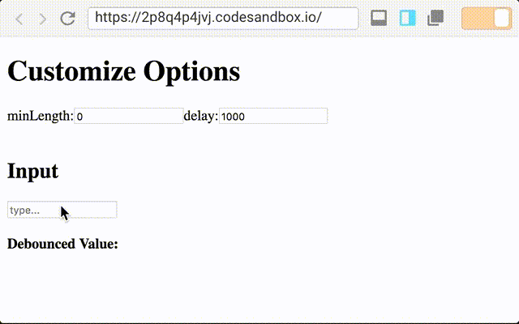

A custom React Hook for debouncing user inputs on Input and Textarea elements.



- [Example](#example)
- [CodeSandbox Example](#codesandbox-example)
- [API Reference](#api-reference)
- [License](#license)

[](https://travis-ci.org/iusehooks/useInputDebounce) 

# Installation
```sh
npm install --save useinputdebounce
```

# Example

```js
import React, { useState } from "react";
import ReactDOM from "react-dom";
import useInputDebounce from "useinputdebounce";

function App() {
  const [results, setSearch] = useState([]);

  const effect = async (value, setValue) => {
    const res = await searchCharacters(value);
    setSearch(res);
  };

  const attributes = useInputDebounce(effect, { delay: 200, minLength: 1 });

  return (
    <div>
      <input {...attributes} placeholder="Search Country..." />
      {results.map(result => (
        <div key={result.name}>
          <h2>{result.name}</h2>
        </div>
      ))}
    </div>
  );
}

const rootElement = document.getElementById("root");
ReactDOM.render(<App />, rootElement);

function searchCharacters(search) {
  return fetch(`https://restcountries.eu/rest/v2/name/${search}`)
    .then(r => r.json())
    .then(r => (r.status !== 404 ? r : []))
    .catch(error => []);
}
```

# CodeSandbox Example

* Fetching Data: [Sandbox](https://codesandbox.io/s/2p8q4p4jvj)

# API Reference

```js
const { value, onChange } = useInputDebounce(effect, [opts])
```

* `effect`: a function that will be excuted after a delay. You can perform actions like fetching data.
* `opts`: an object whose values can be { delay, minLength, initial }

# License

This software is free to use under the MIT license.
See the [LICENSE file](/LICENSE.md) for license text and copyright information.
